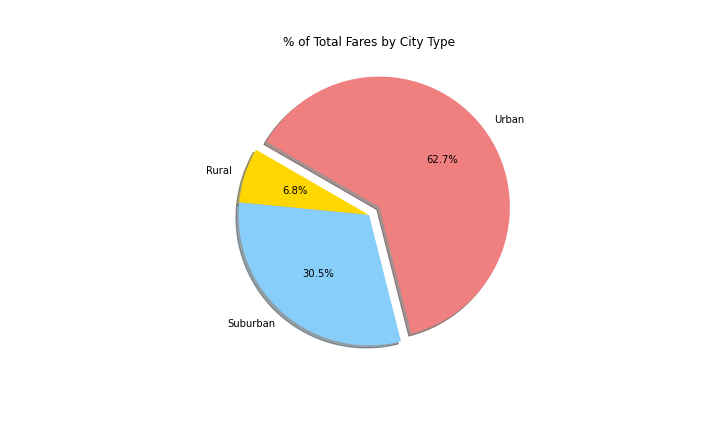

# PyBer_Analysis

## Overview:

The purpose of the new analysis is to summarize the ride-sharing data by city type and generate multiple-line graph that shows the total weekly fares for each city type. A written report is then submitted summarizing how the data differs by city type and how those differences can be used by decision-maker at PyBer.

## Results:

### 1. Ride-sharing data among the different city types.

- Urban cities have the highest percentage in terms of total fare (62.7%), rides (68.4%), and drivers (80.9%) amongst the other city types. That is understandable given the number of people (riders) that lives in urban areas. However, urban cities tend to have the lowest average fare as shown on the picture below and that's probably because there are a lot of competing drivers and the proximity of the destinations.

- Suburban cities tend to be in the middle in terms of  total fare (30.5%), rides (26.3%), and drivers (16.5%) amongst the other city types. These type of cities are a combination of mixed-use or residential area, existing either as part of a city or urban areas. Therefore, commuting from one place to another would take some time especially if they work in the city. That explains why the avarage fare is higher than urban areas. I recommend to expand business in this type of cities.

- Rural cities make up the lowest trend in terms of  total fare (6.8%), rides (5.3%), and drivers (2.6%) amongst the other city types. That is because, a lot of people tend to own cars and does not commute so much compared to the other city types. However, the avarage fare is higher in rural cities because the riders probably has to travel the fardest and less drivers to ride. 

Pyber Ride-Sharing Data:

Percent Total Fare by City Type:

Percent of Total Rides by City Type:

Percent of Total Drivers by City Type:

### 2. Ride-sharing data:

In the set of data, urban areas tend to be the highest in revenues. However all three city types (urban, suburban, and rural) are consistent in total fares in the last 4 months from 010119 to 042919 as shown on the line plot below. There are some peaks but it does not correlate to anything. 

- Total rides

- Total drivers

- Total fares

- Average fare per ride and driver

- Total fare by city type

## Summary:

Uban cities continue to be the money maker for PyBer and because it is the largest source of revenue, they should invest more in this city types to ensure that drivers are fully utilized. I also recommend to also focus efforts on expanding into suburban types cities as it shows some promising data. Rural areas tend to be on the lowest side and that is okay but can invest on initiatives to attract more riders, perhaps some incentives for the customers.